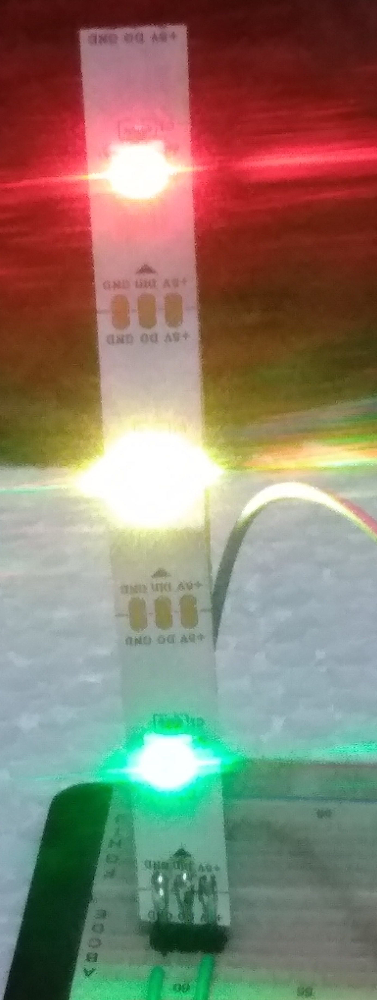

# kkelipT


[](https://www.ti.com/tool/CCSTUDIO)


</br>

<div style="text-align: center;">

</div>


Exemplo de Firmware escrito no **MSP430G2553** que configura 3 Leds do tipo **RGB**, em uma fita **WS2812B**. A transmissão dos comandos é por **SPI**. 

## Detalhes do projeto

Foi utilizado como base de desenvolvimento o projeto kkelipCore
[kkelipCore](https://github.com/Pinablink/kkelipCore).
Algumas modificações foram aplicadas nesse projeto para facilitar a leitura do código. No kkelipCore, a memória Flash e SRAM são manipulados para aplicar as cores nos led(s). Nessa versão as cores são lidas diretamente na memória de programa. 

As cores aplicadas a essa demonstração são Vermelho, Amarelo e Verde. A configuração das cores dos leds segue a de um semáforo de trânsito. A seguir o fragmento de código que contêm a configuração.

## ⚠️ Observação
</br>
A ordem está inversa nessa configuração, se você considerar uma visualização do Tipo Top-Down. Os primeiros 3 bytes do RGB que são enviados, estão posicionados mais abaixo. Para um projeto de iluminação ambiental esta referência tem importância. Pois em um Frame de configuração de uma aplicação final, o posicionamento dos leds para um efeito estético precisa ser avaliado.

</br>


📃 **main.asm**
````
;-------------------------------------------------------------------------------
;                                  DADOS FIXOS
;-------------------------------------------------------------------------------
;                                |G    |R   |B
;-------------------------------------------------------------------------------
LED_CC_COLOR_DEFAULT
						.byte    080H, 000H, 000H  ; Verde
						.byte    0FFH, 0FFH, 000H  ; Amarelo
						.byte    000H, 0FFH, 000H  ; Vermelho
;-------------------------------------------------------------------------------

````

## Ponto de Analise
</br>

A rotina **ON_LEDS** é o ponto para onde todo o processamento do Firmware ocorre para aplicação das cores. 

📃 **main.asm**
````

;-------------------------------------------------------------------------------
ON_LEDS
;-------------------------------------------------------------------------------
                        push.w   R5
                        push.w   R6
                        push.w   R7
                        mov.w    #00000H,R5
                        mov.b    &QT_LED_N,R5
						call     #INIT_SPI_COMM
						mov.w    #LED_CC_COLOR_DEFAULT,R6
						mov.w    #00000H,R7
						mov.b    #0003H,R7
on_leds_loop_main		cmp.b    #000H,R5
						jeq      fin_on_leds_loop_main
on_led_in_rgb_loop		cmp.b    #000H,R7
						jeq      fin_on_led_in_rgb_loop
						call     #SS_STRP
						dec.b    R7
						jmp      on_led_in_rgb_loop
fin_on_led_in_rgb_loop	mov.b    #0003H,R7
                        dec.b    R5
						jmp		 on_leds_loop_main
fin_on_leds_loop_main   nop
main_loop_on_leds       nop
						pop.w    R7
                        pop.w    R6
                        pop.w    R5
						ret
;-------------------------------------------------------------------------------

````


